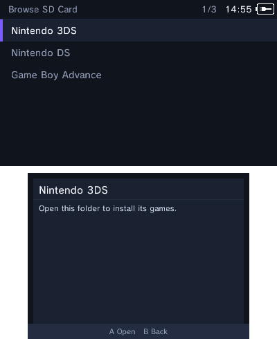
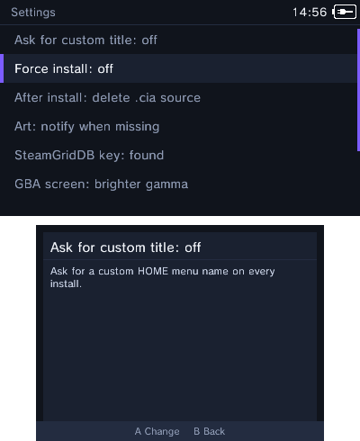

<div align="center">
  <h1>romm3ds</h1>
  <p>
    <strong>Install 3DS, Nintendo DS, and Game Boy Advance games directly on your 3DS.</strong><br>
    Local installs need no PC. Artwork, banners, and DS sounds are handled for you.
  </p>
  <p>
    <a href="https://github.com/nitou2504/romm3ds/releases/tag/v1.1.1"></a>
  </p>
  <p>
    <a href="https://github.com/nitou2504/romm3ds/releases/tag/v1.1.1"><strong>Download v1.1.1</strong></a>
    · <a href="#quick-start">Quick start</a>
    · <a href="#build-from-source">Build from source</a>
  </p>
  <p align="center">
    
  </p>
  <p><em>Pokémon Pinball running as a native HOME-menu title.</em></p>
</div>

## What is romm3ds?

`romm3ds` is an offline-first installer and library browser for modded 3DS
consoles. Copy `.cia`, `.nds`, or `.gba` files to the SD card, or connect an
optional [RomM](https://github.com/rommapp/romm) server. Install one game or a
whole folder, then manage the result from the console.

ZIP archives are supported, but uncompressed files install faster on the 3DS.

## App screenshots

<p align="center">
  
</p>

<table align="center">
  <tr>
    <td align="center" valign="top">
      <br>
      <strong>Browse SD Card</strong>
    </td>
    <td align="center" valign="top">
      <br>
      <strong>Settings</strong>
    </td>
    <td align="center" valign="top">
      <br>
      <strong>HOME menu</strong>
    </td>
  </tr>
</table>

## Highlights

<table align="center">
  <tr>
    <td valign="top" width="50%">
      <strong>Local-first browsing</strong><br>
      Browse the SD card without a server. Mark several games with <code>Y</code>
      and select all or none with <code>R</code>.
    </td>
    <td valign="top" width="50%">
      <strong>Three install paths</strong><br>
      Install 3DS CIAs, turn DS ROMs into HOME-menu forwarders, and build native
      GBA Virtual Console titles.
    </td>
  </tr>
  <tr>
    <td valign="top" width="50%">
      <strong>Artwork that stays with the game</strong><br>
      Search several art sources automatically, choose your own icon or banner,
      and update the result later from Manage.
    </td>
    <td valign="top" width="50%">
      <strong>Optional RomM integration</strong><br>
      Browse your <code>3ds</code>, <code>nds</code>, and <code>gba</code> libraries
      over HTTP Basic authentication. RomM 4.x and 5.x are supported.
    </td>
  </tr>
</table>

## Requirements

- A 3DS with [Luma3DS](https://github.com/LumaTeam/Luma3DS) CFW and the
  Homebrew Launcher.
- For DS games, the
  [NTR_Forwarder DS Forwarder Pack](https://github.com/RocketRobz/NTR_Forwarder),
  TWiLight Menu++ / nds-bootstrap, and the YANBF `bootstrap.cia` title must
  already be installed on the SD card or console.
- Internet access is optional for local files. It is needed for RomM and for
  the first download of artwork and DS sounds. Cached artwork can be reused
  offline.

## Quick start

### 1. Install the application

Choose one format:

- **CIA:** install `romm3ds.cia` with FBI. This creates a normal HOME-menu app.
- **3DSX:** copy `romm3ds.3dsx` to `sd:/3ds/` and launch it from the Homebrew
  Launcher.

### 2. Add local games

The local SD browser exposes only these folders:

| Folder | Files | Purpose |
|---|---|---|
| `sd:/roms/3ds` | `.cia` | Install 3DS titles |
| `sd:/roms/nds` | `.nds` and supported ZIP archives | Build DS HOME-menu titles |
| `sd:/roms/gba` | `.gba` and supported ZIP archives | Build GBA Virtual Console titles |

> **Scope:** The local browser does not show arbitrary folders outside
> `/roms`. Put each file in the matching platform folder.

Open **Browse SD Card**, choose a platform, and press **A** on a game. Use
**Y** to mark several games and **R** to select all or none.

### 3. Connect RomM (optional)

Open **Settings**, enter the RomM server address, username, and password, then
browse the library from **RomM Library**. Local installs do not require RomM.

## How each format works

### 3DS CIA

A `.cia` is streamed into the 3DS title database with `AM_StartCiaInstall`.
The CIA supplies its own icon, banner, and sound.

### Nintendo DS

`romm3ds` turns an `.nds` file into a HOME-menu title that tells
nds-bootstrap which ROM to boot. It adds the selected icon, banner, and sound
to a template CIA, then installs it with a unique title ID.

At launch, the forwarder passes the ROM path to
`sd:/_nds/ntr-forwarder/path.txt`.

The [YANBF assets](https://github.com/YANBForwarder/assets) repository is the
primary source for DS art and sounds.

### Game Boy Advance

A GBA ROM is embedded into a native AGB_FIRM Virtual Console CIA — **this is
not emulation**. The builder creates the HOME-menu title from the bundled
forwarder template and can apply one of the built-in screen presets.

The source `.gba` remains on the SD card because the app needs it for artwork
changes and reinstall operations.

## Manage and customize

From **Manage Installed**, you can:

- see installed titles and storage usage;
- change icons, banners, and GBA screen filters;
- reinstall or uninstall games;
- remove 3DS updates and DLC; and
- clear downloaded art caches without removing your saved per-game art picks.

**Settings** controls the RomM connection, GBA defaults, missing-art prompts,
art display preferences, and the delete-after-install policy.

## Build from source

Builds require Docker and internet access on the first run so `makerom` and
`bannertool` can be downloaded.

```sh
./build.sh              # template + 3DSX + CIA
./build.sh 3dsx         # template + 3DSX
./build.sh cia          # template + 3DSX + CIA
./build.sh template     # forwarder template only
```

Generated files are written at the repository root and are ignored by Git:

```text
romm3ds.3dsx
romm3ds.smdh
romm3ds.elf
romm3ds.cia
```

GitHub Actions builds the same files. Version tags create releases with the
CIA, 3DSX, SMDH, and checksum files.

### Hardware iteration over FTP

```sh
./push.sh 192.168.0.22 # current 3DS IP; change it if DHCP assigns another address
```

This performs a clean 3DSX build and uploads it to
`sd:/3ds/romm3ds.3dsx`.

## Credits and licenses

`romm3ds` started as a fork of **NDSForwarder** and incorporates work from
many upstream projects:

- **[NDSForwarder](https://github.com/volkanturkut/NDSForwarder)** by Volkan
  Turkut, itself based on
  **[ndsForwarder](https://github.com/MechanicalDragon0687/ndsForwarder)** by
  RandalHoffman. GPL-3.0.
- **[YANBF](https://github.com/YANBForwarder/YANBF)** and
  **[YANBF assets](https://github.com/YANBForwarder/assets)** by lifehackerhansol.
- **[NTR_Forwarder](https://github.com/RocketRobz/NTR_Forwarder)**,
  **[nds-bootstrap](https://github.com/DS-Homebrew/nds-bootstrap)**, and
  **[TWiLight Menu++](https://github.com/DS-Homebrew/TWiLightMenu)** by the
  RocketRobz and DS-Homebrew teams.
- **[RomM](https://github.com/rommapp/romm)** by the RomM team.
- The forwarder DSiWare template from **Olmectron**'s Forwarder3-DS.
- **[makerom / ctrtool](https://github.com/3DSGuy/Project_CTR)**,
  **[bannertool](https://github.com/carstene1ns/3ds-bannertool)**, and the
  **[devkitPro](https://devkitpro.org/)** toolchain.
- **[FBI](https://github.com/Steveice10/FBI)** for FS/AM usage patterns.

Vendored third-party source:

- [miniz](https://github.com/richgel999/miniz) — MIT.
- [stb_image](https://github.com/nothings/stb) — public domain / MIT.
- [nlohmann/json](https://github.com/nlohmann/json) — MIT.

This project is released under the **GPL-3.0**. See [LICENSE.md](LICENSE.md).
The upstream README is preserved as [README.upstream.md](README.upstream.md).
