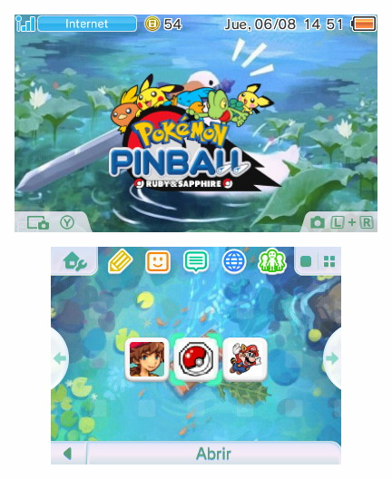
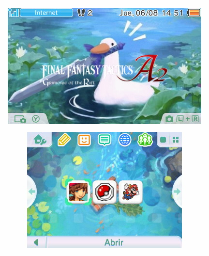
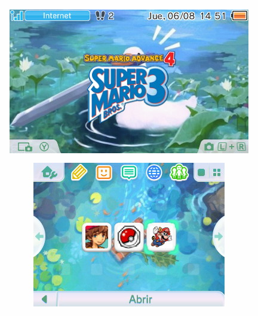

# romm3ds



[](https://github.com/nitou2504/romm3ds/actions/workflows/release.yml)

Install 3DS, DS and GBA games directly on your console with nice looking art! No PC needed.
Copy `.cia`, `.nds` or `.gba` files to the SD card (or connect a [RomM](https://github.com/rommapp/romm) instance). Install one game or a
whole folder. Artwork (Icon and Banner) is scraped automatically (or chosen per game). DS
games also get a jingle from the [YANBF sounds repo](https://github.com/YANBForwarder/assets).

For local installs, the SD browser exposes only `sd:/roms/3ds`, `sd:/roms/nds`
and `sd:/roms/gba`. Files in other folders are not shown by that browser.

ZIP files are supported, but uncompressed files are recommended to speed up the installs.


| Library | Manage | App menu |
|---|---|---|
|  |  |  |

### Recent HOME-menu screenshots

| Pokémon Pinball | Final Fantasy Tactics A2 | Super Mario Bros. 3 |
|---|---|---|
|  |  |  |

**[Get the latest release here.](https://github.com/nitou2504/romm3ds/releases/tag/v1.1.1)**

## Features

- **Browse SD Card** — open `sd:/roms` and choose one of the three exposed
  folders: `3ds`, `nds` or `gba`. Put local `.cia`, `.nds` and `.gba` files in
  the matching folder. Use `Y` to mark several games and `R` to select all or
  none.
- **Install 3DS games** — install a supplied `.cia` to the HOME menu.
- **Install Nintendo DS games** — turn an `.nds` file into its own HOME-menu
  game with its icon, banner art and jingle.
- **Install Game Boy Advance games** — turn a `.gba` file into its own
  HOME-menu game with artwork and optionally choose screen presets.
- **Artwork** — automatically search several online sources for icon and banner art.
- **Manage installed games** — see storage usage, change art, uninstall titles or remove 3DS updates/DLC to free up space.
- **RomM Integration** — browse and install from your `3ds`, `nds` and `gba` lan instance over
  HTTP Basic authentication. RomM 4.x and 5.x versions are
  supported.
- **Settings** — configure RomM, Default GBA screen presets, artwork
  flow and the roms delete policy.

## Requirements

- A 3DS with Luma3DS CFW and the Homebrew Launcher.
- For DS games, the [NTR_Forwarder](https://github.com/RocketRobz/NTR_Forwarder)
  DS Forwarder Pack, TWiLight Menu++ / nds-bootstrap and the YANBF
  `bootstrap.cia` title must already be installed on the SD card/console.
- Internet access is optional for local files, but is needed for RomM and for
  the artwork and DS jingles.

## Installation

- **CIA:** install `romm3ds.cia` with FBI. This creates a normal HOME-menu
  application.
- **3DSX:** copy `romm3ds.3dsx` to `sd:/3ds/` and launch it from the Homebrew
  Launcher.

To use RomM, open **Settings**, enter the server address, username and password.

The default browse location is `sd:/roms`. The local browser exposes only
these folders:

| Folder | Files |
|---|---|
| `sd:/roms/3ds` | `.cia` |
| `sd:/roms/nds` | `.nds` and supported ZIP archives |
| `sd:/roms/gba` | `.gba` and supported ZIP archives |

It does not browse arbitrary folders outside `/roms`.

## How each format works

### 3DS

A `.cia` is streamed into the 3DS title database with
`AM_StartCiaInstall`. Each game has its icon, banner and sound.

### Nintendo DS

A forwarder is a HOME-menu title
that tells nds-bootstrap which `.nds` file to boot. `romm3ds` patches a
template CIA on the console, adds the selected icon/banner/sound and
installs it with a unique title ID.

At launch, the forwarder passes the ROM path to
`sd:/_nds/ntr-forwarder/path.txt` to boot the game.

The [YANBF assets](https://github.com/YANBForwarder/assets) repository is the
primary source for art.

### Game Boy Advance

A GBA ROM is embedded into a native AGB_FIRM Virtual Console CIA (**Not emulation**). The builder
uses the bundled template pieces to create a GBA forwarder on the HOME-menu.

GBA ROMs remain on the SD card after installation because the app needs the
source ROM for artwork changes.

## Credits and licences

`romm3ds` started as fork of **NDSForwarder** and incorporates work from many
upstream projects:

- **[NDSForwarder](https://github.com/volkanturkut/NDSForwarder)** by Volkan
  Turkut, itself based on **[ndsForwarder](https://github.com/MechanicalDragon0687/ndsForwarder)**
  by RandalHoffman. GPL-3.0.
- **[YANBF](https://github.com/YANBForwarder/YANBF)** and
  **[YANBF assets](https://github.com/YANBForwarder/assets)** by lifehackerhansol.
- **[NTR_Forwarder](https://github.com/RocketRobz/NTR_Forwarder)**,
  **[nds-bootstrap](https://github.com/DS-Homebrew/nds-bootstrap)** and
  **[TWiLight Menu++](https://github.com/DS-Homebrew/TWiLightMenu)** by the
  RocketRobz and DS-Homebrew teams.
- **[RomM](https://github.com/rommapp/romm)** by the RomM team.
- The forwarder DSiWare template from **Olmectron**'s Forwarder3-DS.
- **[makerom / ctrtool](https://github.com/3DSGuy/Project_CTR)**,
  **[bannertool](https://github.com/carstene1ns/3ds-bannertool)** and the
  **[devkitPro](https://devkitpro.org/)** toolchain.
- **[FBI](https://github.com/Steveice10/FBI)** for FS/AM usage patterns.

Vendored third-party source:

- [miniz](https://github.com/richgel999/miniz) — MIT.
- [stb_image](https://github.com/nothings/stb) — public domain / MIT.
- [nlohmann/json](https://github.com/nlohmann/json) — MIT.

This project is released under the **GPL-3.0**. See [LICENSE.md](LICENSE.md).
The upstream README is preserved as [README.upstream.md](README.upstream.md).

## Building from source

Builds require Docker and internet access on the first run so `makerom` and
`bannertool` can be downloaded.

```sh
./build.sh              # template + 3DSX + CIA
./build.sh 3dsx         # template + 3DSX
./build.sh cia          # template + 3DSX + CIA
./build.sh template     # forwarder template only
```

Generated files are written at the repository root and are ignored by Git:

```text
romm3ds.3dsx
romm3ds.smdh
romm3ds.elf
romm3ds.cia
```

GitHub Actions builds the same files. Version tags create releases with the
individual CIA, 3DSX and SMDH files.

For hardware iteration over FTP:

```sh
./push.sh 192.168.0.22 # current 3DS IP; change it if DHCP assigns another address
```

This performs a clean 3DSX build and uploads it to `sd:/3ds/romm3ds.3dsx`.
