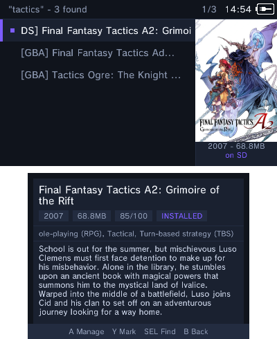
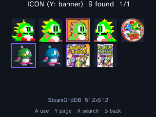
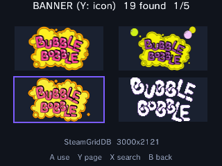

<div align="center">
  <h1>romm3ds</h1>
  <p>
    <strong>Install 3DS, DS and GBA games directly on your console with nice looking art!</strong><br>
    No PC is needed to create DS and GBA HOME-menu titles.
  </p>
  <p>
    <a href="https://github.com/nitou2504/romm3ds/releases/tag/v1.1.1"></a>
  </p>
  <p>
    <a href="https://github.com/nitou2504/romm3ds/releases/tag/v1.1.1"><strong>Download v1.1.1</strong></a>
    · <a href="#quick-start">Quick start</a>
    · <a href="#build-from-source">Build from source</a>
  </p>
  <p align="center">
    
  </p>
  <p><em>Pokémon Pinball running as a native HOME-menu title.</em></p>
</div>

## What is romm3ds?

Copy `.cia`, `.nds` or `.gba` files to the SD card (or connect a
[RomM](https://github.com/rommapp/romm) instance). Install one game or a whole
folder. Artwork (Icon and Banner) is scraped automatically (or chosen per
game). DS games also get a jingle from the
[YANBF sounds repo](https://github.com/YANBForwarder/assets).

ZIP files are supported, but uncompressed files are recommended to speed up
the installs.

## App screenshots

<table align="center">
  <tr>
    <td align="center" valign="top">
      <br>
      <strong>Base screen</strong>
    </td>
    <td align="center" valign="top">
      <br>
      <strong>RomM search</strong>
    </td>
    <td align="center" valign="top">
      <br>
      <strong>Manage with sizes</strong>
    </td>
  </tr>
</table>

<p align="center"><strong>GBA art selection</strong> — bottom-screen icon and banner pickers</p>

<table align="center">
  <tr>
    <td align="center" valign="top">
      <br>
      <strong>Icon</strong>
    </td>
    <td align="center" valign="top">
      <br>
      <strong>Banner</strong>
    </td>
  </tr>
</table>

## Features

- **Browse SD Card** — open `sd:/roms` and choose one of the three exposed
  folders: `3ds`, `nds` or `gba`. Put local `.cia`, `.nds` and `.gba` files in
  the matching folder. Use `Y` to mark several games and `R` to select all or
  none.
- **Install 3DS games** — install a supplied `.cia` to the HOME menu.
- **Install Nintendo DS games** — turn an `.nds` file into its own HOME-menu
  game with its icon, banner art and jingle.
- **Install Game Boy Advance games** — turn a `.gba` file into its own
  HOME-menu game with artwork and optionally choose screen presets.
- **Artwork** — automatically search several online sources for icon and banner
  art.
- **Manage installed games** — see storage usage, change art, uninstall titles
  or remove 3DS updates/DLC to free up space.
- **RomM Integration** — browse and install from your `3ds`, `nds` and `gba`
  RomM libraries over HTTP Basic authentication. RomM 4.x and 5.x are
  supported.
- **Settings** — configure RomM, default GBA screen presets, artwork flow and
  the roms delete policy.

## Art sources

SteamGridDB is the primary art source when a key is configured. It is searched
first for a strong game match and is the first-choice source for GBA HOME icons.
The key is read from `sd:/3ds/forwarder/sgdb.env`.

| Source | Used for | Notes |
|---|---|---|
| [SteamGridDB](https://www.steamgriddb.com/) | GBA icons; NDS/GBA logos and picker art | Highest priority for strong matches and HOME icons; requires an API key. |
| [libretro Named_Logos](http://thumbnails.libretro.com/Nintendo%20-%20Game%20Boy%20Advance/Named_Logos/) | GBA banners | Exact No-Intro filename match, with a tag-stripped retry. |
| [iiSU](https://assets.iisu.community/) | Icons and logos | Exact-name fallback and picker source; no key required. |
| SD assets, [YANBF assets](https://github.com/YANBForwarder/assets), and GameTDB | DS banners and sounds | Existing SD art is preferred, followed by the online DS sources. |
| RomM covers | Icon/banner fallback and picker art | Uses the cover from the configured RomM library when other art is missing. |

For GBA banners, the exact libretro logo is tried before iiSU and the RomM
cover. SteamGridDB remains the primary match and icon source.

## Requirements

- A 3DS with Luma3DS CFW and the Homebrew Launcher.
- For DS games, the [NTR_Forwarder](https://github.com/RocketRobz/NTR_Forwarder)
  DS Forwarder Pack, TWiLight Menu++ / nds-bootstrap and the YANBF
  `bootstrap.cia` title must already be installed on the SD card/console.
- Internet access is optional for local files, but is needed for RomM and for
  the artwork and DS jingles.

## Quick start

### 1. Install the application

Choose one format:

- **CIA:** install `romm3ds.cia` with FBI. This creates a normal HOME-menu app.
- **3DSX:** copy `romm3ds.3dsx` to `sd:/3ds/` and launch it from the Homebrew
  Launcher.

### 2. Add local games

The local SD browser exposes only these folders:

| Folder | Files | Purpose |
|---|---|---|
| `sd:/roms/3ds` | `.cia` | Install 3DS titles |
| `sd:/roms/nds` | `.nds` and supported ZIP archives | Build DS HOME-menu titles |
| `sd:/roms/gba` | `.gba` and supported ZIP archives | Build GBA Virtual Console titles |

> **Scope:** The local browser does not show arbitrary folders outside
> `/roms`. Put each file in the matching platform folder.

Open **Browse SD Card**, choose a platform, and press **A** on a game. Use
**Y** to mark several games and **R** to select all or none.

### 3. Connect RomM (optional)

To use RomM, open **Settings**, enter the server address, username and password.

## How each format works

### 3DS

A `.cia` is streamed into the 3DS title database with
`AM_StartCiaInstall`. Each game has its icon, banner and sound.

### Nintendo DS

A forwarder is a HOME-menu title that tells nds-bootstrap which `.nds` file
to boot. `romm3ds` patches a template CIA on the console, adds the selected
icon/banner/sound and installs it with a unique title ID.

At launch, the forwarder passes the ROM path to
`sd:/_nds/ntr-forwarder/path.txt` to boot the game.

The [YANBF assets](https://github.com/YANBForwarder/assets) repository is the
primary source for art.

### Game Boy Advance

A GBA ROM is embedded into a native AGB_FIRM Virtual Console CIA (**Not emulation**).
The builder uses the bundled template pieces to create a GBA forwarder on the
HOME-menu.

GBA ROMs remain on the SD card after installation because the app needs the
source ROM for artwork changes.

## Manage and customize

From **Manage Installed**, you can:

- see installed titles and storage usage;
- change icons, banners, and GBA screen filters;
- reinstall or uninstall games;
- remove 3DS updates and DLC; and
- clear downloaded art caches without removing your saved per-game art picks.

**Settings** controls the RomM connection, GBA defaults, missing-art prompts,
art display preferences, and the delete-after-install policy.

## Build from source

Builds require Docker and internet access on the first run so `makerom` and
`bannertool` can be downloaded.

```sh
./build.sh              # template + 3DSX + CIA
./build.sh 3dsx         # template + 3DSX
./build.sh cia          # template + 3DSX + CIA
./build.sh template     # forwarder template only
```

Generated files are written at the repository root and are ignored by Git:

```text
romm3ds.3dsx
romm3ds.smdh
romm3ds.elf
romm3ds.cia
```

GitHub Actions builds the same files. Version tags create releases with the
CIA, 3DSX, SMDH, and checksum files.

### Hardware iteration over FTP

```sh
./push.sh 192.168.0.22 # current 3DS IP; change it if DHCP assigns another address
```

This performs a clean 3DSX build and uploads it to
`sd:/3ds/romm3ds.3dsx`.

## Credits and licenses

`romm3ds` started as a fork of **NDSForwarder** and incorporates work from
many upstream projects:

- **[NDSForwarder](https://github.com/volkanturkut/NDSForwarder)** by Volkan
  Turkut, itself based on
  **[ndsForwarder](https://github.com/MechanicalDragon0687/ndsForwarder)** by
  RandalHoffman. GPL-3.0.
- **[YANBF](https://github.com/YANBForwarder/YANBF)** and
  **[YANBF assets](https://github.com/YANBForwarder/assets)** by lifehackerhansol.
- **[NTR_Forwarder](https://github.com/RocketRobz/NTR_Forwarder)**,
  **[nds-bootstrap](https://github.com/DS-Homebrew/nds-bootstrap)**, and
  **[TWiLight Menu++](https://github.com/DS-Homebrew/TWiLightMenu)** by the
  RocketRobz and DS-Homebrew teams.
- **[RomM](https://github.com/rommapp/romm)** by the RomM team.
- The forwarder DSiWare template from **Olmectron**'s Forwarder3-DS.
- **[makerom / ctrtool](https://github.com/3DSGuy/Project_CTR)**,
  **[bannertool](https://github.com/carstene1ns/3ds-bannertool)**, and the
  **[devkitPro](https://devkitpro.org/)** toolchain.
- **[FBI](https://github.com/Steveice10/FBI)** for FS/AM usage patterns.

Vendored third-party source:

- [miniz](https://github.com/richgel999/miniz) — MIT.
- [stb_image](https://github.com/nothings/stb) — public domain / MIT.
- [nlohmann/json](https://github.com/nlohmann/json) — MIT.

This project is released under the **GPL-3.0**. See [LICENSE.md](LICENSE.md).
The upstream README is preserved as [README.upstream.md](README.upstream.md).
