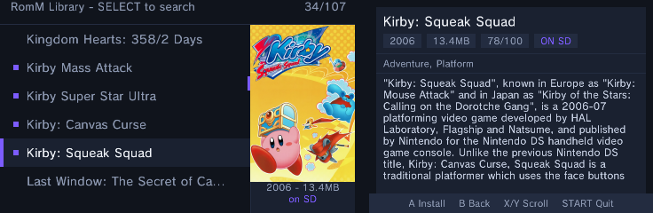
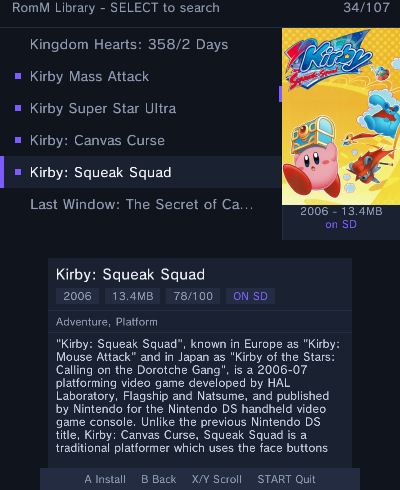
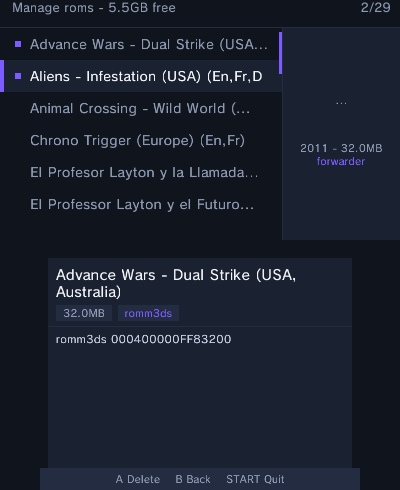
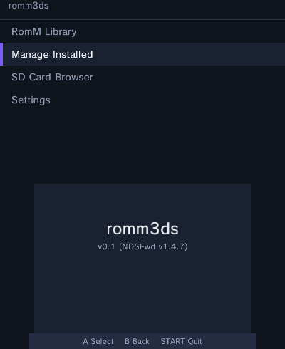
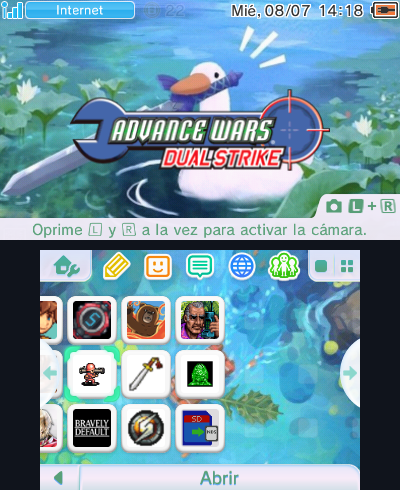

# romm3ds

Browse your self-hosted [RomM](https://github.com/rommapp/romm) NDS library **on the 3DS**, download ROMs to the SD card, and build YANBF-style HOME-menu forwarders that launch each game through nds-bootstrap — no PC in the loop. An hShop-like experience for your own DS collection.



| Library | Manage | Home |
|---|---|---|
|  |  |  |

Each installed forwarder appears on the HOME menu with real box art and the game's jingle, just like a store-bought title:



## Features

- **RomM Library** — lists the `nds` platform of your RomM server over HTTP Basic auth (works against a stock authenticated instance). Box art, year, genres, rating and summary are pulled from RomM metadata; covers are prefetched in the background and cached on the SD card so scrolling never blocks. `SELECT` searches the library instantly.
- **One-tap install** — download (zip archives are extracted on-device), then build and install a forwarder whose banner carries the game's box art and sound, exactly like a YANBF forwarder — but generated entirely on the console. No ~40-title DSiWare cap.
- **Install a whole folder at once** — in the **SD Card Browser**, the "Install All" entry builds forwarders for every `.nds` in the current folder in one go — point it at your DS collection and walk away.
- **Manage Installed** — every ROM in `sd:/roms/nds` with its forwarder state (romm3ds / TWL / YANBF) and title IDs. Install a forwarder for a ROM that doesn't have one yet, or delete the forwarder, the ROM, or both.
- **SD Card Browser** — the classic NDSForwarder flow for local `.nds` files, including batch "Install All".
- **Settings** — installer options and a dedicated RomM server screen (edit host / user / password individually, test the connection).

## What is a forwarder? (and what YANBF is)

The 3DS can't run DS games itself, but [nds-bootstrap](https://github.com/DS-Homebrew/nds-bootstrap) can. A *forwarder* is a tiny HOME-menu title that, when launched, tells nds-bootstrap which `.nds` file to boot — so a DS game gets its own icon on the HOME menu instead of living inside a launcher.

**[YANBF](https://github.com/YANBForwarder/YANBF)** ("Yet Another nds-bootstrap Forwarder", by lifehackerhansol) is the established PC tool for making these: it generates a CTR forwarder CIA per ROM with `makerom`/`bannertool` and installs it with FBI or custom-install. romm3ds does the same job **on the console** — it patches a prebuilt template so no PC toolchain is needed — and it deliberately reuses YANBF's runtime chain and art so its forwarders look and behave identically to YANBF's.

**Where the banner art and sound come from:** for each game (matched by its 4-letter DS game code) romm3ds pulls the wide banner logo and jingle from the community **[YANBF assets](https://github.com/YANBForwarder/assets)** repository — the same source YANBF uses. These are mirrored to `sd:/3ds/forwarder/assets/` so they work offline. If a game has no YANBF asset it falls back to a [GameTDB](https://www.gametdb.com/) cover, and the HOME icon itself always comes from the ROM's own embedded DS banner.

## Requirements

- A 3DS with Luma3DS CFW (signature patches) and the Homebrew Launcher.
- The nds-bootstrap forwarder chain already on the SD card: the [NTR_Forwarder](https://github.com/RocketRobz/NTR_Forwarder) "DS Forwarder Pack" (`_nds` folder on the SD root) plus a working TWiLight Menu++ / nds-bootstrap install and the YANBF `bootstrap.cia` TWL title (`0004800546574452`) installed to NAND.
- A RomM instance (4.x) reachable over plain HTTP on the LAN (HTTPS works with certificate verification disabled).

## Install

Either:

- **.cia** (installs to the HOME menu): install `romm3ds.cia` with FBI.
- **.3dsx** (Homebrew Launcher): copy `romm3ds.3dsx` to `sd:/3ds/`.

On first run, open **RomM Library** and enter your server address, username and password.

## Build

Everything builds in the official devkitPro docker image (no local toolchain needed beyond docker); `makerom` and `bannertool` are downloaded automatically on first run.

```sh
./build.sh          # forwarder template + .3dsx + .cia
./build.sh 3dsx     # just the Homebrew Launcher build
./build.sh cia      # just the installable title
```

Outputs land at the repo root: `romm3ds.3dsx`, `romm3ds.smdh`, `romm3ds.cia`.

Iterate on hardware over ftpd:

```sh
./push.sh 192.168.0.23   # clean-build + FTP the .3dsx to sd:/3ds/
```

## How a forwarder works

Each forwarder is a CTR application (title ID `000400000FF8xxxx`) built on-device by patching a template CIA (`romfs/ctr/template.cia`, produced by `ctr-template/build.sh` from a small libctru payload + `makerom`/`bannertool`). Per game the builder patches the title IDs, rebuilds the ExeFS with an SMDH icon from the DS banner, swaps the banner's RGBA4444 box-art texture and CWAV sound, recomputes every hash, and installs it with `AM_StartCiaInstall` to the SD. At launch the payload writes the ROM path to `sd:/_nds/ntr-forwarder/path.txt` and chainloads the YANBF bootstrap TWL title via `aptSetChainloader`, which runs NTR_Forwarder → nds-bootstrap → the game. Box art and sound come from the [YANBF assets](https://github.com/YANBForwarder/assets) repository (mirrored to `sd:/3ds/forwarder/assets/` for offline use) with GameTDB as a fallback.

## Credits & licenses

romm3ds is a fork of **NDSForwarder** and stands on a lot of other people's work.

- **[NDSForwarder](https://github.com/volkanturkut/NDSForwarder)** by Volkan Turkut, itself a fork of **[ndsForwarder](https://github.com/MechanicalDragon0687/ndsForwarder)** by RandalHoffman (MechanicalDragon0687) — the on-device DSiWare CIA builder, browser UI and forwarder machinery this project is built on. **GPL-3.0.**
- **[YANBF](https://github.com/YANBForwarder/YANBF)** and **[YANBF assets](https://github.com/YANBForwarder/assets)** by lifehackerhansol — the forwarder payload design, `bootstrap.cia` TWL title, `build-cia.rsf`, and the per-game banner art/sound this app reuses. (MIT for the forwarder payload; see the YANBF repo.)
- **[NTR_Forwarder](https://github.com/RocketRobz/NTR_Forwarder)**, **[nds-bootstrap](https://github.com/DS-Homebrew/nds-bootstrap)** and **[TWiLight Menu++](https://github.com/DS-Homebrew/TWiLightMenu)** by RocketRobz and the DS-Homebrew team — the runtime chain that actually boots the ROMs.
- **[RomM](https://github.com/rommapp/romm)** by the RomM team — the library server this client talks to.
- Forwarder DSiWare template from **Olmectron**'s Forwarder3-DS (`sdcard.nds`/`.fwd`).
- Tooling: **[makerom / ctrtool](https://github.com/3DSGuy/Project_CTR)** by 3DSGuy, **[bannertool](https://github.com/carstene1ns/3ds-bannertool)** (carstene1ns' maintained fork of Steveice10's), and the **[devkitPro](https://devkitpro.org/)** toolchain (devkitARM, libctru, citro2d) by WinterMute et al.
- FS/AM usage patterns referenced from **[FBI](https://github.com/Steveice10/FBI)** by Steveice10.

Vendored third-party source:

- **[miniz](https://github.com/richgel999/miniz)** (Rich Geldreich) — on-device zip extraction. MIT.
- **[stb_image](https://github.com/nothings/stb)** (Sean Barrett) — cover decoding. Public domain / MIT.
- **[nlohmann/json](https://github.com/nlohmann/json)** — RomM API parsing. MIT.

This project is released under the **GPL-3.0** (inherited from NDSForwarder). See `LICENSE.md`. The upstream NDSForwarder README is preserved as `README.upstream.md`.

## Thanks

To everyone above, and to Martin Korth (GBATEK) for the NDS/DSi format documentation that makes any of this possible.
